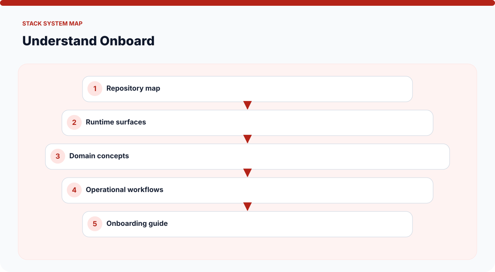
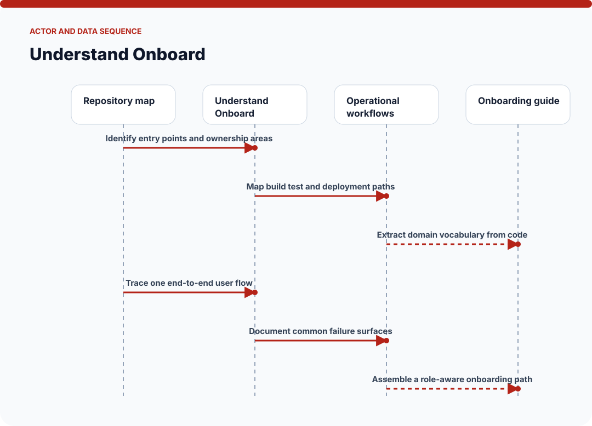
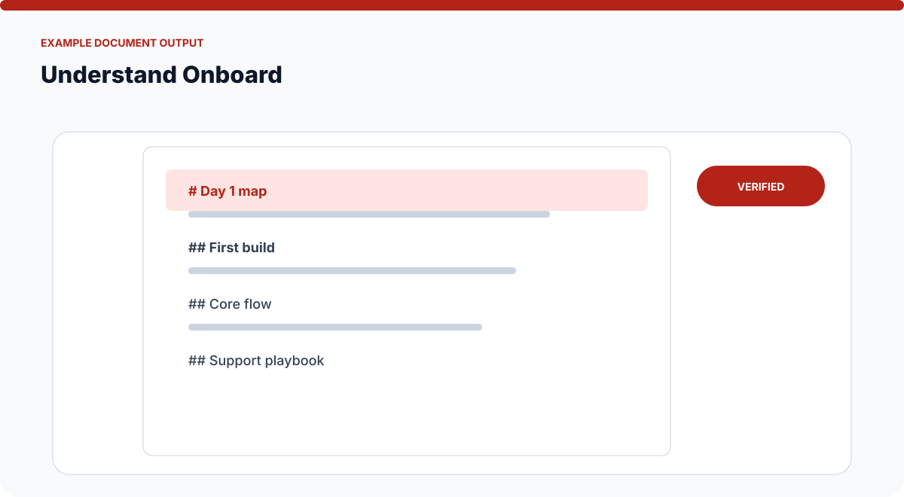
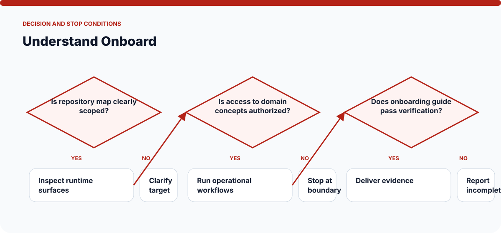

# How Understand Onboard Works

The visuals on this page are static SVGs, so they render directly on GitHub on phones and desktop browsers. Each one is generated from a model specific to this skill.

## System architecture

### Components

- **1. Repository map:** participates in identify entry points and ownership areas.
- **2. Runtime surfaces:** participates in map build test and deployment paths.
- **3. Domain concepts:** participates in extract domain vocabulary from code.
- **4. Operational workflows:** participates in trace one end-to-end user flow.
- **5. Onboarding guide:** participates in document common failure surfaces.

## Actor and data sequence

### 1. Identify entry points and ownership areas

**Primary surface:** `Repository map`

Record the concrete input, the operation performed, and the evidence produced at this stage. Continue only when the output is sufficient for the next stage; otherwise preserve the blocker and stop.
### 2. Map build test and deployment paths

**Primary surface:** `Runtime surfaces`

Record the concrete input, the operation performed, and the evidence produced at this stage. Continue only when the output is sufficient for the next stage; otherwise preserve the blocker and stop.
### 3. Extract domain vocabulary from code

**Primary surface:** `Domain concepts`

Record the concrete input, the operation performed, and the evidence produced at this stage. Continue only when the output is sufficient for the next stage; otherwise preserve the blocker and stop.
### 4. Trace one end-to-end user flow

**Primary surface:** `Operational workflows`

Record the concrete input, the operation performed, and the evidence produced at this stage. Continue only when the output is sufficient for the next stage; otherwise preserve the blocker and stop.
### 5. Document common failure surfaces

**Primary surface:** `Onboarding guide`

Record the concrete input, the operation performed, and the evidence produced at this stage. Continue only when the output is sufficient for the next stage; otherwise preserve the blocker and stop.
### 6. Assemble a role-aware onboarding path

**Primary surface:** `Repository map`

Record the concrete input, the operation performed, and the evidence produced at this stage. Continue only when the output is sufficient for the next stage; otherwise preserve the blocker and stop.

## Example output shape

The example is a visual contract: a real run may look different, but it should expose comparable state, provenance, and verification information. It is not presented as evidence of a live external action.

## Decision and stop conditions

The workflow stops when the target is ambiguous, the relevant surface is unavailable or unauthorized, or the final artifact cannot be checked. A logged-in session or successful tool call is not by itself proof that the requested outcome is complete.

## Verification checklist

- Confirm every component shown in the system map exists in the target environment.
- Trace the actor sequence using actual tool output or artifact state.
- Compare the result with the example-output information contract.
- Re-read or reopen the final artifact instead of trusting an attempt message.
- Report omitted stages, unsupported capabilities, and remaining human decisions.
